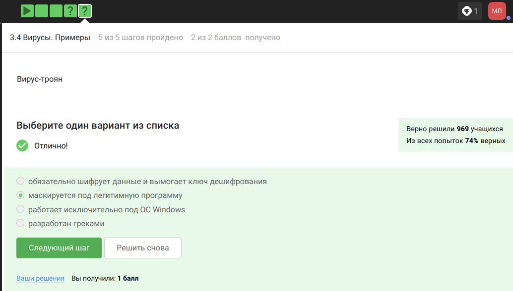
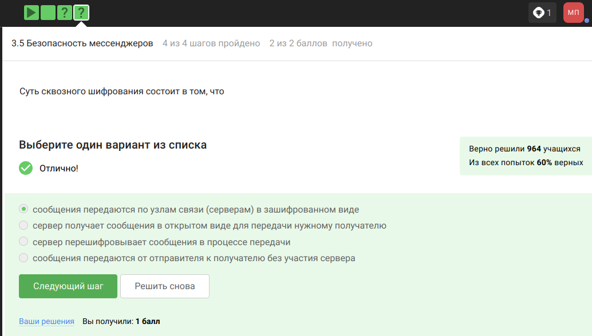

---
## Front matter
lang: ru-RU
title: Внешний курс 
subtitle: Основы информационной безопасности 
author:
  - Прокопьева М. Е.
institute:
  - Российский университет дружбы народов, Москва, Россия

## i18n babel
babel-lang: russian
babel-otherlangs: english

## Fonts
mainfont: IBM Plex Serif
romanfont: IBM Plex Serif
sansfont: IBM Plex Sans
monofont: IBM Plex Mono
mathfont: STIX Two Math
mainfontoptions: Ligatures=Common,Ligatures=TeX,Scale=0.94
romanfontoptions: Ligatures=Common,Ligatures=TeX,Scale=0.94
sansfontoptions: Ligatures=Common,Ligatures=TeX,Scale=MatchLowercase,Scale=0.94
monofontoptions: Scale=MatchLowercase,Scale=0.94,FakeStretch=0.9
mathfontoptions:

## Formatting pdf
toc: false
toc-title: Содержание
slide_level: 2
aspectratio: 169
section-titles: true
theme: metropolis
header-includes:
 - \metroset{progressbar=frametitle,sectionpage=progressbar,numbering=fraction}
---

# Информация

## Докладчик

  * Прокопьева Марина Евгеньевна 
  * студент
  * Российский университет дружбы народов

# Цель работы

Пройти курс на степике и узнать много нового (или нет) 

# Выполнение 

UDP - протокол сетевого уровня 
TCP - протокол транспортного уровня
HTTPS - протокол прикладного уровня
IP - протокол сетевого уровня,
поэтому ответ HTTPS

{#fig:001 width=70%}

## Ранее было упомянуто, что протокол TCP - transmission control protocol - работает на транспортном уровне

{#fig:002 width=70%}

## В адресе типа IPv4 не может быть чисел больше 255, поэтому первые два варианта не подходят

{#fig:003 width=70%}

## DNS-сервер, Domain name server — приложение, предназначенное для ответов на DNS-запросы по соответствующему протоколу Обязательное условие – Сопоставление сервером доменных имен доменного имени с IP-адресом называется разрешением имени и адреса

{#fig:004 width=70%}

## Распределение протоколов в модели TCP/IP:

- Прикладной уровень (Application Layer): HTTP, RTSP, FTP, DNS.

- Транспортный уровень (Transport Layer): TCP, UDP, SCTP, DCCP.

- Сетевой (Межсетевой) уровень (Network Layer): IP.

- Уровень сетевого доступа (Канальный) (Link Layer): Ethernet, IEEE 802.11, WLAN, SLIP, Token Ring

{#fig:005 width=70%}

## протокол http передает не зашифрованные данные, а протокол https уже будет передавать зашифрованные данные

{#fig:006 width=70%}

## https передает зашифрованные данные, одна из фаз - передача данных, другая должна быть рукопожатием

{#fig:007 width=70%}

## TLS определяется и клиентом, и сервером, чтобы было возможно подключиться

{#fig:008 width=70%}

## остальные варианты в протоколе предусмотрены

{#fig:009 width=70%}

## Куки точно не хранят пароли и IP-адреса, а id ceccии и идентификатор хранят

{#fig:010 width=70%}

## куки не делают соединение более надежным

{#fig:011 width=70%}

{#fig:012 width=70%}

## Сессионные куки хранятся в течение сессии, то есть пока используется веб-сайт

{#fig:013 width=70%}

## Необходимо три узла - входной, промежуточный и выходной

{#fig:014 width=70%}

## IP-адрес не должен быть известен охранному и промежуточному узлам

{#fig:015 width=70%}

## Отправитель генерирует общий секретный ключ со узлами, через которые идет передача, то есть со всеми

{#fig:016 width=70%}

## Для получаения пакетов не нужно использовать TOR

{#fig:017 width=70%}

## это определение Wi-Fi

{#fig:018 width=70%}

## Для целей работы в Интернете Wi-Fi обычно располагается как канальный уровень

{#fig:019 width=70%}

## WEP (Wired Equivalent Privacy) – устаревший и небезопасный метод проверки подлинности

{#fig:020 width=70%}

## Нужно аутентифицировать устройства и позже передаются зашифрованные данные

{#fig:021 width=70%}

## WPA2 Personal для личного использования

{#fig:022 width=70%}

## Шифрование диска — технология защиты информации, переводящая данные на диске в нечитаемый код, который нелегальный пользователь не сможет легко расшифровать.

{#fig:023 width=70%}

## Шифрование диска основано на симметричном шифровании

{#fig:024 width=70%}

## Отмечены программы, с помощью которых можно зашифровать жетский диск

{#fig:025 width=70%}

## Стойкий пароль - тот, который тяжлее подобрать, он должен быть со спец. символами и длинный

{#fig:026 width=70%}

## Все варианты, кроме менеджера паролей, совершенно не надежные

{#fig:027 width=70%}

Капча нужна для проверки на то, что за экраном "не робот"

{#fig:028 width=70%}

## Опасно хранить пароли в открытом виде, поэтому хранят их хэши 

{#fig:029 width=70%}

Соль не поможет

{#fig:030 width=70%}

## Все приведенные меры защищают от утечек данных

{#fig:031 width=70%}

## Фишинговые ссылки очень похожи на ссылки известных сервисов, но с некоторыми отличиями 

{#fig:032 width=70%}

Да, может, например, если пользователя со знакомым адресом взломали

{#fig:033 width=70%}

## Ответ дан в соответствии с определением

{#fig:034 width=70%}

## Троян маскируется под обычную программу

{#fig:035 width=70%}

При установке первого сообщения отправителем формируется ключ шифрования

{#fig:036 width=70%}

## Суть сквозного шифрования состоит в том, что сообзения передаются по узлам связи в зашифрованном виде

{#fig:037 width=70%}

## Для ответа на вопрос используется определение ассмиетричного шифрования с двумя ключами

{#fig:038 width=70%}

Отмечены основные условия для криптографической хэш-функции

{#fig:039 width=70%}

## Отмечены алгоритмы цифровой подписи

{#fig:040 width=70%}

## В информационной безопасности аутентификация 
сообщения или аутентификация источника данных-это свойство, которое гарантирует, что сообщение не было изменено во время передачи (целостность данных) и что принимающая сторона может проверить источник сообщения

{#fig:041 width=70%}

## Определение обмена ключами Диффи-Хэллмана. 

{#fig:042 width=70%}

По определению цифровой подписи протокол ЭЦП относится к протоколам с публичным ключом

{#fig:043 width=70%}

## На первом этапе получатель сообщения строит собственный вариант хэш-функции подписанного документа. На втором этапе происходит расшифровка хэш-функции, содержащейся в сообщении с помощью открытого ключа отправителя. На третьем этапе производится сравнение двух хэш- функций. Их совпадение гарантирует одновременно подлинность содержимого документа и его авторства

{#fig:044 width=70%}

## Электронная подпись обеспечивает все указанное, кроме конфиденциальности

{#fig:045 width=70%}

## Для отправки налоговой отчетности в ФНС используется усиленная квалифицированная электронная подпись

{#fig:046 width=70%}

{#fig:047 width=70%}

## Известные платежные системы - Visa, MasterCard, МИР 

{#fig:048 width=70%}

{#fig:049 width=70%}

## При онлайн платежах используется многофакторная аутентификация

{#fig:050 width=70%}

## Proof-of-Work, или PoW, (доказательство выполнения работы) — это алгоритм достижения консенсуса в блокчейне

{#fig:051 width=70%}

## Консенсус блокчейна — это процедура, в ходе которой участники сети достигают согласия о текущем состоянии данных в сети

{#fig:052 width=70%}

{#fig:053 width=70%}

## Прошла курс на степике 

{#fig:054 width=70%}

# Выводы

Прошла курс на степике 
