---
## Front matter
lang: ru-RU
title: Структура научной презентации
subtitle: Простейший шаблон
author:
  - Кулябов Д. С.
institute:
  - Российский университет дружбы народов, Москва, Россия
  - Объединённый институт ядерных исследований, Дубна, Россия
date: 01 января 1970

## i18n babel
babel-lang: russian
babel-otherlangs: english

## Formatting pdf
toc: false
toc-title: Содержание
slide_level: 2
aspectratio: 169
section-titles: true
theme: metropolis
header-includes:
 - \metroset{progressbar=frametitle,sectionpage=progressbar,numbering=fraction}
---

# Информация

## Докладчик

  * Прокопьева Марина Евгеньевна
  * 1132237370
  * Российский университет дружбы народов

# Вводная часть

## Актуальность

- Важно донести результаты своих исследований до окружающих
- Научная презентация --- рабочий инструмент исследователя
- Необходимо создавать презентацию быстро
- Желательна минимизация усилий для создания презентации

## Объект и предмет исследования

- Презентация как текст
- Программное обеспечение для создания презентаций
- Входные и выходные форматы презентаций

## Цели и задачи

- Создать шаблон презентации в Markdown
- Описать алгоритм создания выходных форматов презентаций

## Материалы и методы
# Цель работы

Целью данной работы является приобретение практических навыков
установки операционной системы на виртуальную машину, настройки ми-
нимально необходимых для дальнейшей работы сервисов.

# Задание

Загрузите в дисплейном классе операционную систему Linux. Осуществите
вход в систему. Запустите терминал. Перейдите в каталог /var/tmp:
cd /var/tmp
Создайте каталог с именем пользователя (совпадающий с логином студен-
та в дисплейном классе). Для этого можно использовать команду:
mkdir /var/tmp/`id -un`
или непосредственно:
mkdir /var/tmp/имя_пользователя
Здесь вместо имя_пользователя должен быть указан ваш логин (учётная
запись) в дисплейном классе.

# Запустите виртуальную машину, введя в командной строке:

VirtualBox &
Проверьте в свойствах VirtualBox месторасположение каталога
для виртуальных машин. Для этого в VirtualBox выберите Файл
Настройки , вкладка Общие . В поле Папка для машин должно стоять
/var/tmp/имя_пользователя. Здесь имя_пользователя — логин (учёт-
ная запись) студента в дисплейном классе. Если указан другой каталог, то
требуется изменить его, как указано выше.

# Если вы работаете не в дисплейном классе, а на собственной технике, то

расположение каталога виртуальных машин определяете по своему усмот-
рению.
VirtualBox &
Проверьте в свойствах VirtualBox месторасположение каталога
для виртуальных машин. Для этого в VirtualBox выберите Файл
Настройки , вкладка Общие . В поле Папка для машин должно стоять
/var/tmp/имя_пользователя. Здесь имя_пользователя — логин (учёт-
ная запись) студента в дисплейном классе. Если указан другой каталог, то
требуется изменить его, как указано выше.

## Если вы работаете не в дисплейном классе, а на собственной технике, то

расположение каталога виртуальных машин определяете по своему усмот-
рению.

Создайте новую виртуальную машину. Для этого в VirtualBox выберите
Машина Создать .
Укажите имя виртуальной машины (ваш логин в дисплейном классе), тип
операционной системы — Linux, RedHat (64-bit) 

## Укажите размер основной памяти виртуальной машины  — 2048

МБ (или большее число, кратное 1024 МБ, если позволяют технические ха-
рактеристики вашего компьютера).
Задайте конфигурацию жёсткого диска — загрузочный, VDI (BirtualBox Disk
Image), динамический виртуальный диск
Задайте размер диска — 40 ГБ (или больше), его расположение — в данном
случае /var/tmp/имя_пользователя/имя_пользователя.vdi .
Выберите в VirtualBox для Вашей виртуальной машины Настройки
Носители
## Добавьте новый привод оптических дисков и выберите образ

операционной системы, например для работающих в дисплейных клас-
сах /afs/dk.sci.pfu.edu.ru/common/files/iso/Rocky-номер_версии.iso
Если вы работаете на собственной технике, то DVD-образ операционной
системы под архитектуру вашего компьютера необходимо предварительно
скачать с официального сайта.
## Запустите виртуальную машину , выберите English в качестве
языка интерфейса и перейдите к настройкам установки опера-
ционной системы .
При необходимости скорректируйте часовой пояс, раскладку клавиатуры
(рекомендуется добавить русский язык, но в качестве языка по умолчанию
указать английский язык; задать комбинацию клавиш для переключения
между раскладками клавиатуры — например Alt + Shift ).
В разделе выбора программ укажите в качестве базового окружения
Server with GUI , а в качестве дополнения — Development Tools.
Отключите KDUMP

## Место установки ОС оставьте без изменения.

Окно подключения или создания жёсткого диска на виртуальной
машине
РОкно определения типа подключения виртуального жёсткого диска
Включите сетевое соединение и в качестве имени узла укажите
user.localdomain , где вместо user укажите имя своего пользо-
вателя в соответствии с соглашением об именовании.
Установите пароль для root и пользователя с правами администратора
После завершения установки операционной системы корректно переза-
пустите виртуальную машину и при запросе примите условия
лицензии 

## В VirtualBox оптический диск должен отключиться автоматически, но если

это не произошло, то необходимо отключить носитель информации с обра-
зом, выбрав Свойства Носители Rocky-номер-версии.iso Удалить устройство 
Информационная безопасность компьютерных сетей 13
 Установка английского языка интерфейса ОС
Войдите в ОС под заданной вами при установке учётной записью. В меню
Устройства виртуальной машины подключите образ диска дополнений госте-
вой ОС при необходимости введите пароль пользователя
root вашей виртуальной ОС.

## Окно настройки установки образа ОС

Окно настройки установки: выбор программ
Установка имени пользователя и названия хоста
Если при установке виртуальной машины вы задали имя пользователя или
имя хоста, не удовлетворяющее соглашению об именовании (
то вам необходимо исправить это.

# 1. Запустите виртуальную машину и залогиньтесь.

2. Запустите терминал и получите полномочия администратора:
su -
Информационная безопасность компьютерных сетей 15
окно настройки установки: отключение KDUMP
Окно настройки установки: место установки
3. Создайте пользователя (вместо username укажите ваш логин в дисплей-
ном классе):
adduser -G wheel username

# 4. Задайте пароль для пользователя (вместо username укажите ваш логин

в дисплейном классе):
passwd username
5. Установите имя хоста (вместо username укажите ваш логин в дисплейном
классе):
hostnamectl set-hostname username
6. Проверьте, что имя хоста установлено верно:
hostnamectl

# Выполнение лабораторной работы

Заходим в виртуальную машину и начинаем работать в ней

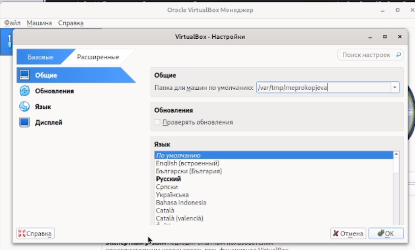{#fig:001 width=70%}

Заполняем имя и тип операционной системы для нашей виртуальной машины 

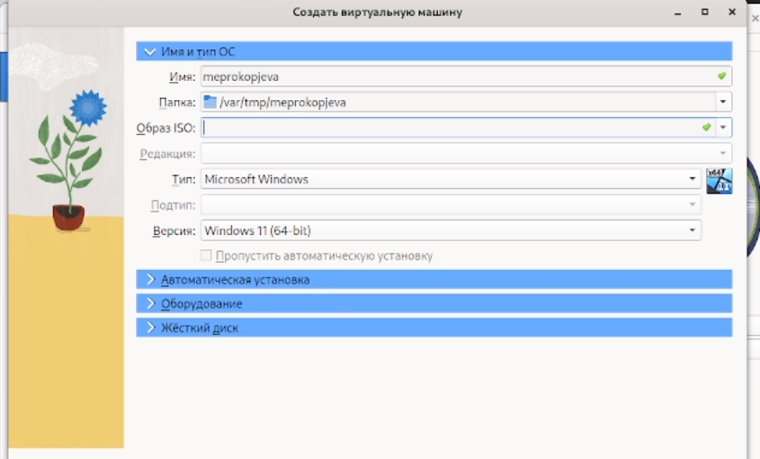{#fig:002 width=70%}

## Выбираем 2048 мб и 2 процессора 

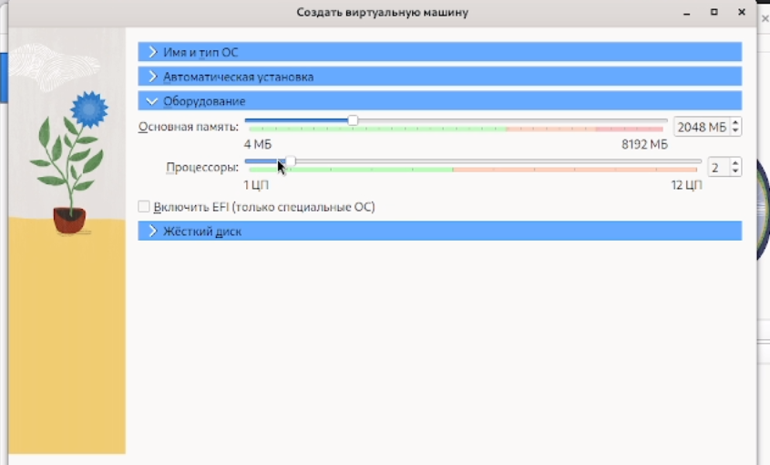{#fig:003 width=70%}

Проверяем расположение жесткого диска и выбираем 40гб или более 

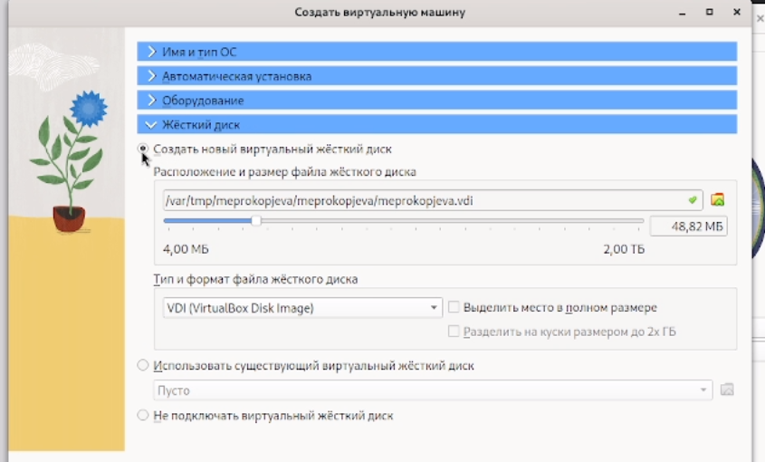{#fig:004 width=70%}

## В носителях заранее выбрали оптический диск Рокси 

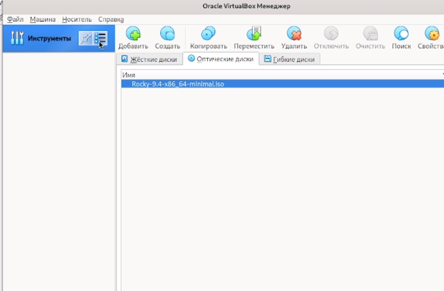{#fig:005 width=70%}

В образе ISO должно выглядеть так 

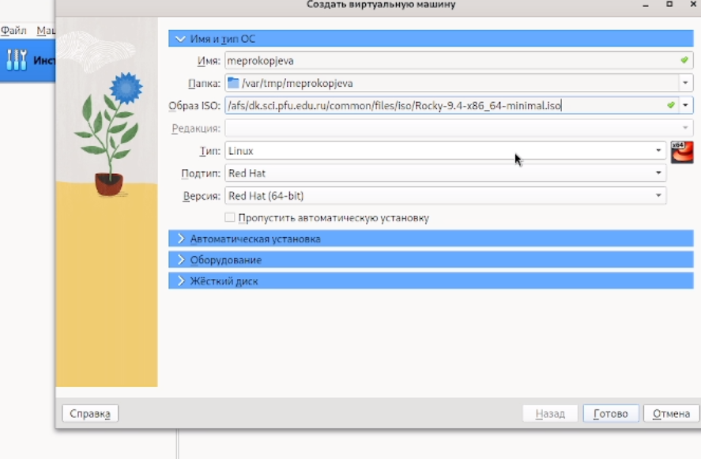{#fig:006 width=70%}

## Устанавливаем автоматическую установку 

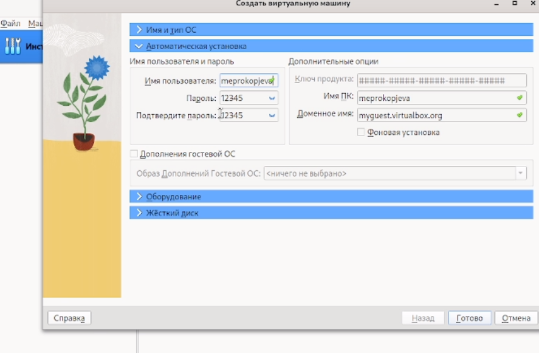{#fig:007 width=70%}

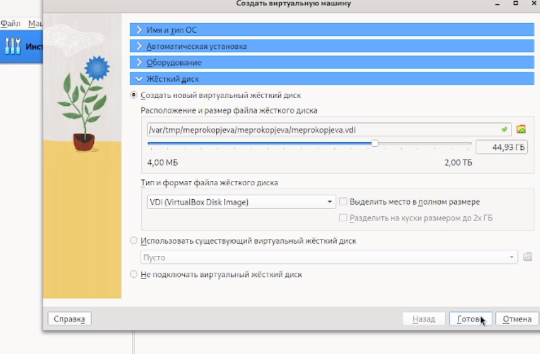{#fig:008 width=70%}

## Появляется наша виртуальная машина 

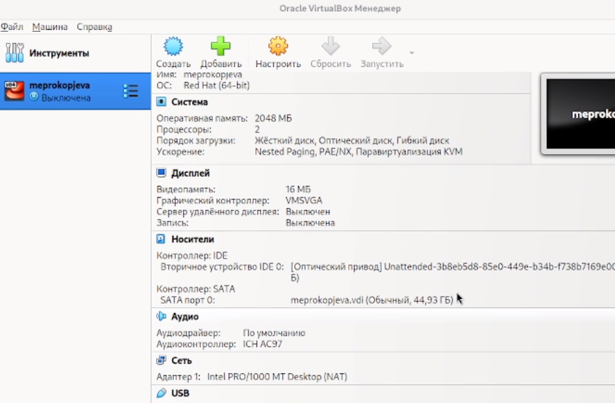{#fig:009 width=70%}

## Открываем нашу виртуальную машину 

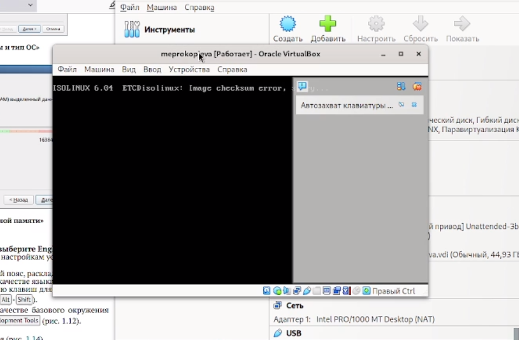{#fig:010 width=70%}

## Разбираемся в чем ошибка 

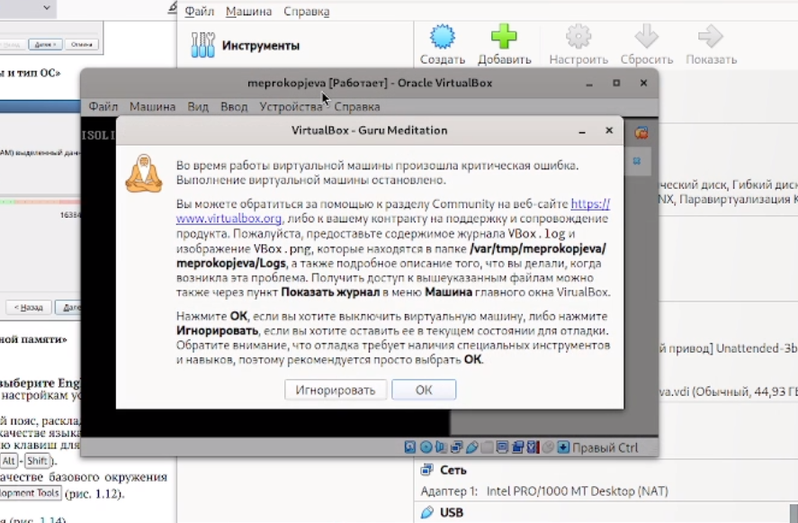{#fig:011 width=70%}

## Разобрались в чем ошибка и открыли нашу виртуальную машину 

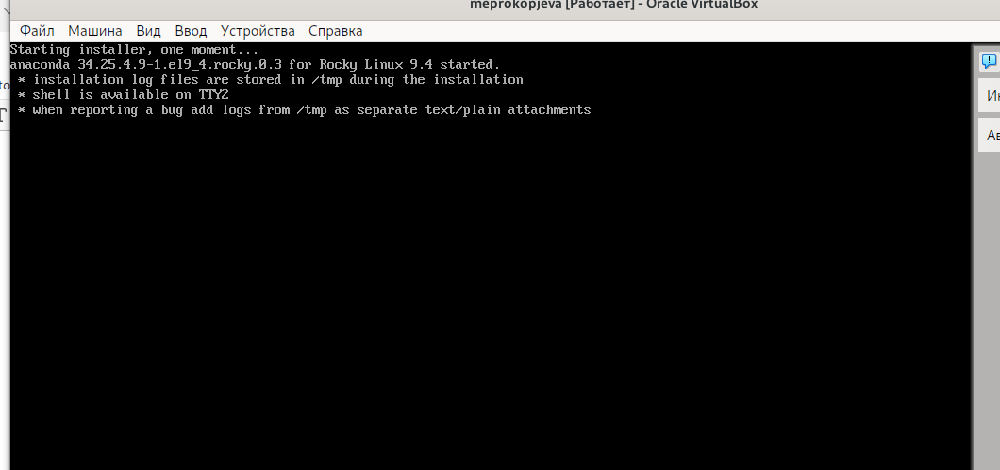{#fig:012 width=70%}

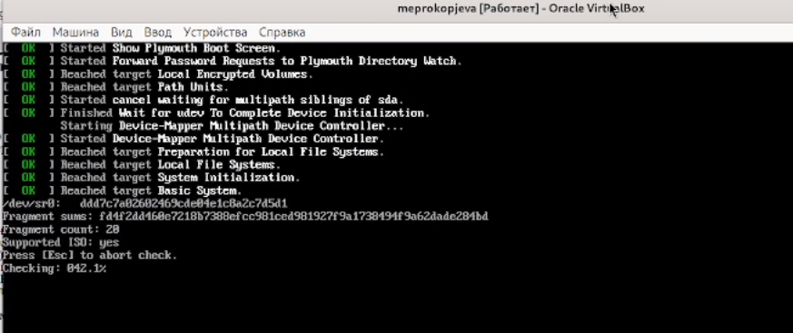{#fig:013 width=70%}

## Настраиваем машину как нам надо 

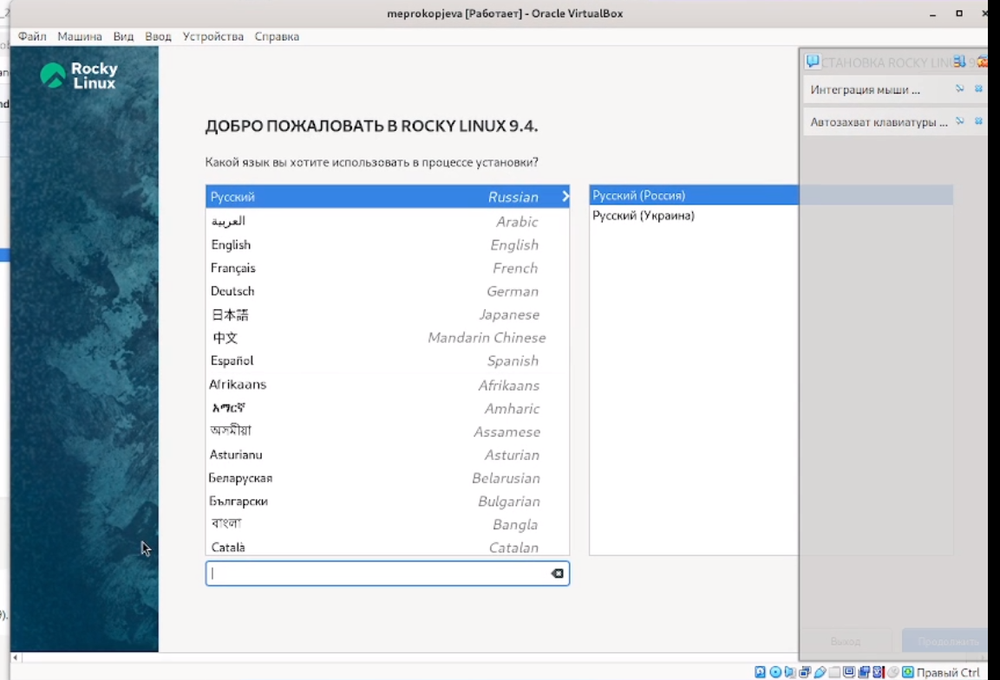{#fig:014 width=70%}

## Выбираем диск 

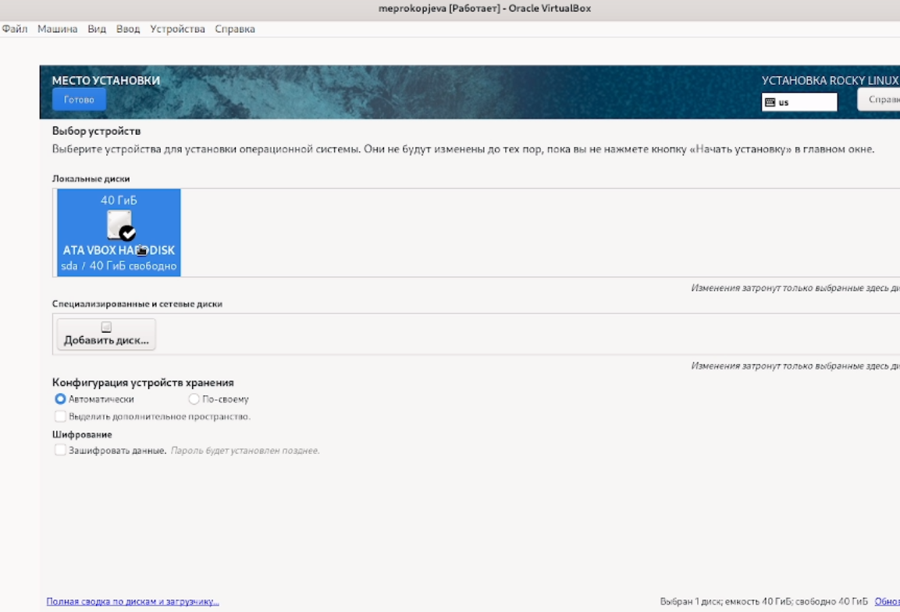{#fig:015 width=70%}

## Настриваем пароль

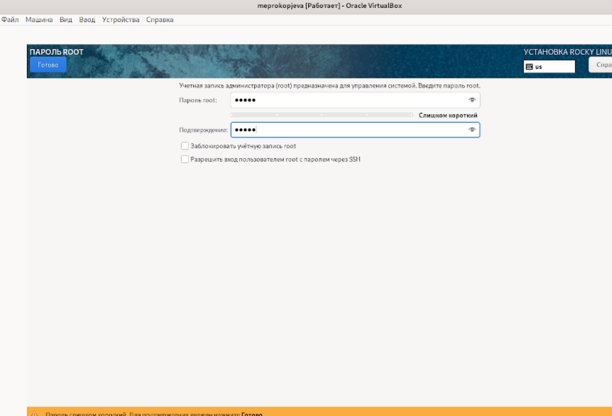{#fig:016 width=70%}

## Ждем установку 

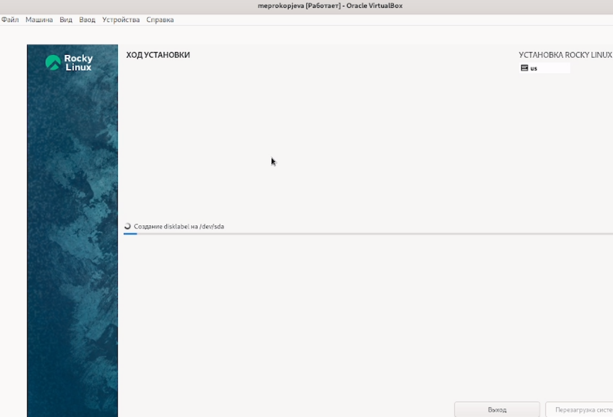{#fig:017 width=70%}

## Успех 

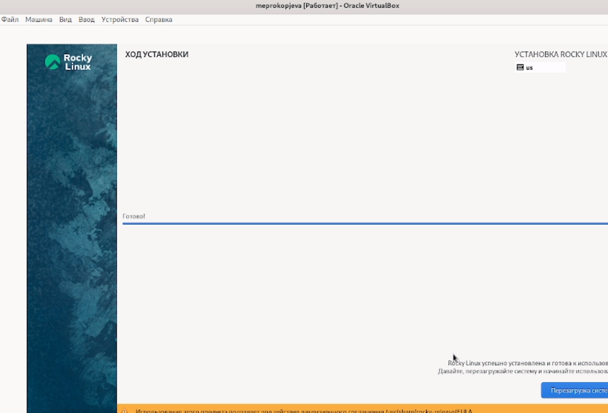{#fig:018 width=70%}

## Она работает и вводим нам пароль и логин 

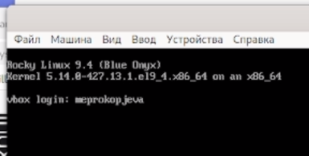{#fig:019 width=70%}

## Все работает !

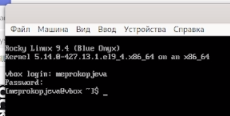{#fig:020 width=70%}

# Выводы

Я приобрела навыки установки операционной системы на виртуальную машину и настроила минимально необходимые для дальнейшей работы сервисы

