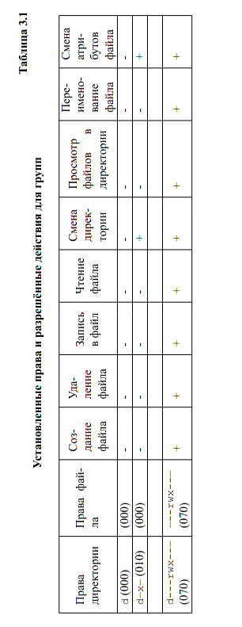
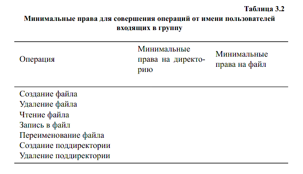

---
## Front matter
lang: ru-RU
title: Лабораторная номер 3
subtitle: Дискреционное разграничение прав в Linux. Два пользователя
author:
  - Прокопьева Марина 
institute:
  - Российский университет дружбы народов, Москва, Россия

## i18n babel
babel-lang: russian
babel-otherlangs: english

## Formatting pdf
toc: false
toc-title: Содержание
slide_level: 2
aspectratio: 169
section-titles: true
theme: metropolis
header-includes:
 - \metroset{progressbar=frametitle,sectionpage=progressbar,numbering=fraction}
---

# Информация

## Докладчик

  * Прокопьева Марина Евгеньевна
  * студент
  * Российский университет дружбы народов

# Вводная часть

## Цели и задачи

Получение практических навыков работы в консоли с атрибутами фай-
лов для групп пользователей

# Теоретическое введение

{#fig:001 width=70%}

{#fig:001 width=70%}

# Выполнение лабораторной работы

1. установленной операционной системе создайте учётную запись поль-
зователя guest (использую учётную запись администратора):
useradd guest
## 2. Задайте пароль для пользователя guest (использую учётную запись ад-
министратора):
passwd guest
3. Аналогично создайте второго пользователя guest2.
4. Добавьте пользователя guest2 в группу guest:
gpasswd -a guest2 guest
## 5. Осуществите вход в систему от двух пользователей на двух разных кон-
солях: guest на первой консоли и guest2 на второй консоли.
6. Для обоих пользователей командой pwd определите директорию, в кото-
рой вы находитесь. Сравните её с приглашениями командной строки.
7. Уточните имя вашего пользователя, его группу, кто входит в неё
и к каким группам принадлежит он сам. Определите командами
groups guest и groups guest2, в какие группы входят пользовате-
ли guest и guest2. Сравните вывод команды groups с выводом команд
id -Gn и id -G.
## 8. Сравните полученную информацию с содержимым файла /etc/group.
Просмотрите файл командой
cat /etc/group
9. От имени пользователя guest2 выполните регистрацию пользователя
guest2 в группе guest командой
newgrp guest
## 10. От имени пользователя guest измените права директории /home/guest,
разрешив все действия для пользователей группы:
chmod g+rwx /home/guest
11. От имени пользователя guest снимите с директории /home/guest/dir1
все атрибуты командой
chmod 000 dirl

# Выводы
Получила практические навыки работы в консоле с атрибутами файлов для групп пользователей

