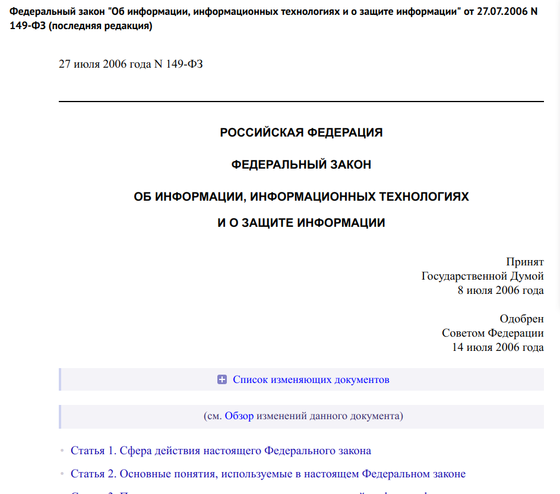
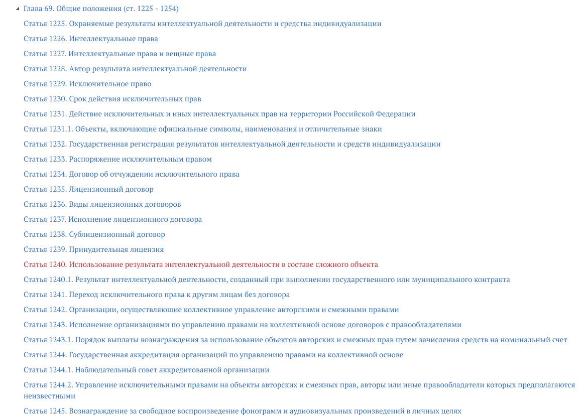
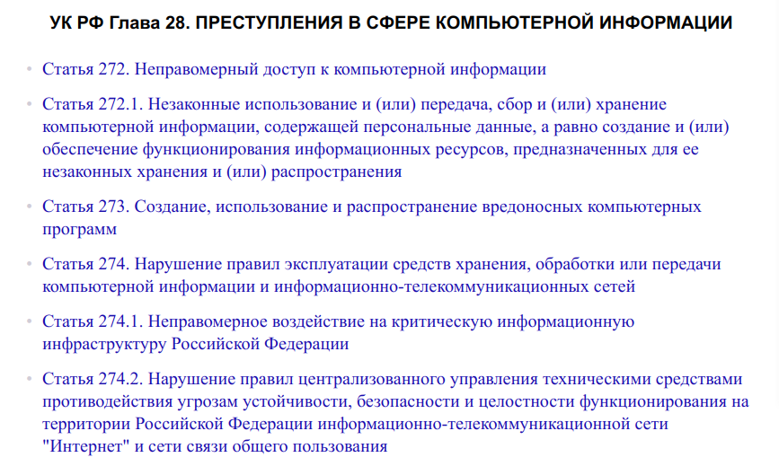

---
## Front matter
lang: ru-RU
title: Презентация по теме
subtitle: Информационное право и информационная безопасность.
author:
  - Прокопьева М. Е.
institute:
  - Российский университет дружбы народов, Москва, Россия
date: 24 марта 2025

## i18n babel
babel-lang: russian
babel-otherlangs: english

## Fonts
mainfont: IBM Plex Serif
romanfont: IBM Plex Serif
sansfont: IBM Plex Sans
monofont: IBM Plex Mono
mathfont: STIX Two Math
mainfontoptions: Ligatures=Common,Ligatures=TeX,Scale=0.94
romanfontoptions: Ligatures=Common,Ligatures=TeX,Scale=0.94
sansfontoptions: Ligatures=Common,Ligatures=TeX,Scale=MatchLowercase,Scale=0.94
monofontoptions: Scale=MatchLowercase,Scale=0.94,FakeStretch=0.9
mathfontoptions:

## Formatting pdf
toc: false
toc-title: Содержание
slide_level: 2
aspectratio: 169
section-titles: true
theme: metropolis
header-includes:
 - \metroset{progressbar=frametitle,sectionpage=progressbar,numbering=fraction}
---

# Информация

## Докладчик

:::::::::::::: {.columns align=center}
::: {.column width="70%"}

  * Прокопьева Марина Евгеньевна
  * студент 
  * кафедры кибербезопасность в экономике 
  * Российский университет дружбы народов
  * (1132237370@pfur.ru)
  * <https://github.com/MarinaPE02-23>

:::
::: {.column width="30%"}

:::
::::::::::::::

# Цель работы

Рассказать о теме "Информационное право и информационная безопасность."

# Введение

## Лицензионное соглашение, информационная безопасность, защита информации.

{#fig:001 width=70%}

В основе производства, распространения, преобразования и потребления информации лежат информационные процессы сбора, создания, обработки, накопления, хранения, поиска информации в обществе, а также процессы создания и применения информационных систем и технологий.

При выполнении рассмотренных информационных процессов возникают социальные (общественные) отношения, которые подлежат правовому регулированию. Соответственно объектом правовых взаимоотношений выступает информация.

# Законы и права 

{#fig:002 width=70%}

## РОССИЙСКАЯ ФЕДЕРАЦИЯ ФЕДЕРАЛЬНЫЙ ЗАКОН ОБ ИНФОРМАЦИИ, ИНФОРМАЦИОННЫХ ТЕХНОЛОГИЯХ И О ЗАЩИТЕ ИНФОРМАЦИИ

{#fig:005 width=70%}

Этот закон регулирует отношения, возникающие при: осуществлении права на поиск, получение, передачу и производство информации; применении информационных технологий; обеспечении защиты информации. В частности, в статье 8 «Право на доступ к информации» утверждается право гражданина на получение из официальных источников информации о деятельности государственных органов, об использовании бюджетных средств, о состоянии окружающей среды, и пр., 

## Гражданский кодекс РФ Часть четвертая (ст. 1225 - 1551) 

{#fig:006 width=70%}

Дает юридически точное определение понятий, связанных с авторством и распространением компьютерных программ и баз данных. Он определяет, что авторское право распространяется на указанные объекты, являющиеся результатом творческой деятельности автора. Автор (или авторы) имеет исключительное право на выпуск в свет программ и баз данных, их распространение, модификацию и иное использование. Однако имущественные права на указанные объекты, созданные в порядке выполнения служебных обязанностей или по заданию работодателя, принадлежат работодателю.

## закон №152-0ФЗ «О персональных данных» 

Обработка персональных данных  — любое действие (операция) или совокупность действий (операций), совершаемых с использованием средств автоматизации или без использования таких средств с персональными данными.

Включая:

- Сбор
- Запись
- Систематизацию
- Накопление
- Хранение
и др. 

## УК РФ Глава 28. ПРЕСТУПЛЕНИЯ В СФЕРЕ КОМПЬЮТЕРНОЙ ИНФОРМАЦИИ 

{#fig:007 width=70%}

Он определил меру наказания за некоторые виды преступлений:

- неправомерный доступ к охраняемой законом компьютерной информации
- создание, распространение или использование вредоносных компьютерных программ;
- нарушение правил эксплуатации средств хранения, обработки или передачи охраняемой компьютерной информации

# Доктрина информационной безопасности Российской Федерации

Доктрина информационной безопасности Российской Федерации представляет собой совокупность официальных взглядов на цели, задачи, принципы и основные направления обеспечения информационной безопасности Российской Федерации

## Различают несанкционированное и непреднамеренное воздействие на информацию

    Несанкционированное воздействие — это действие, которое выполняется без разрешения владельца информации или системы. 

    Непреднамеренное воздействие — это действия, которые происходят без злого умысла и могут быть вызваны ошибками, недоразумениями или техническими сбоями. 
    
## Виды антивирусов 

Для борьбы с вирусами существуют программы, которые можно разбить на основные группы: мониторы, детекторы, доктора, ревизоры и вакцины.
   - Программы мониторы 
   - Программы-детекторы 
   - Программы-доктора 
   - Программы-ревизоры
   - Программы-вакцины 
   
# Выводы

В заключение, информационное право и информационная безопасность представляют собой взаимосвязанные сферы, которые играют важную роль в современном цифровом мире. Информационное право регулирует отношения, связанные с созданием и использованием информации, обеспечивая защиту прав пользователей и интеллектуальной собственности. В то же время, информационная безопасность фокусируется на защите данных от несанкционированного доступа и утечек.

## Литература 

https://studfile.net/preview/5249598/page:4/
https://www.consultant.ru/document/cons_doc_LAW_208191/
https://www.consultant.ru/document/cons_doc_LAW_10699/4398865e2a04f4d3cd99e389c6c5d62e684676f1/ 

