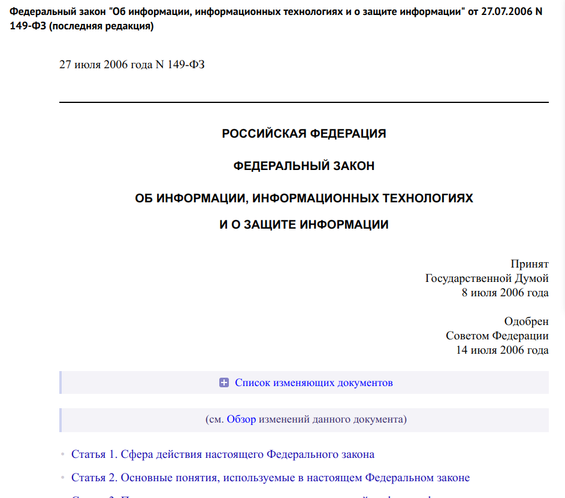

---
## Front matter
title: "Доклад по Основам Иформационной Безопасности "
subtitle: "Информационное право и информационная безопасность."
author: "Прокопьева Марина Евгеньевна"

## Generic otions
lang: ru-RU
toc-title: "Содержание"

## Bibliography
bibliography: bib/cite.bib
csl: pandoc/csl/gost-r-7-0-5-2008-numeric.csl

## Pdf output format
toc: true # Table of contents
toc-depth: 2
lof: true # List of figures
lot: true # List of tables
fontsize: 12pt
linestretch: 1.5
papersize: a4
documentclass: scrreprt
## I18n polyglossia
polyglossia-lang:
  name: russian
  options:
	- spelling=modern
	- babelshorthands=true
polyglossia-otherlangs:
  name: english
## I18n babel
babel-lang: russian
babel-otherlangs: english
## Fonts
mainfont: IBM Plex Serif
romanfont: IBM Plex Serif
sansfont: IBM Plex Sans
monofont: IBM Plex Mono
mathfont: STIX Two Math
mainfontoptions: Ligatures=Common,Ligatures=TeX,Scale=0.94
romanfontoptions: Ligatures=Common,Ligatures=TeX,Scale=0.94
sansfontoptions: Ligatures=Common,Ligatures=TeX,Scale=MatchLowercase,Scale=0.94
monofontoptions: Scale=MatchLowercase,Scale=0.94,FakeStretch=0.9
mathfontoptions:
## Biblatex
biblatex: true
biblio-style: "gost-numeric"
biblatexoptions:
  - parentracker=true
  - backend=biber
  - hyperref=auto
  - language=auto
  - autolang=other*
  - citestyle=gost-numeric
## Pandoc-crossref LaTeX customization
figureTitle: "Рис."
tableTitle: "Таблица"
listingTitle: "Листинг"
lofTitle: "Список иллюстраций"
lotTitle: "Список таблиц"
lolTitle: "Листинги"
## Misc options
indent: true
header-includes:
  - \usepackage{indentfirst}
  - \usepackage{float} # keep figures where there are in the text
  - \floatplacement{figure}{H} # keep figures where there are in the text
---

# Цель работы

Рассказать о теме "Информационное право и информационная безопасность."

# Введение

## Лицензионное соглашение, информационная безопасность, защита информации.

{#fig:001 width=70%}

В современном обществе большинство людей занято деятельностью в информационной сфере, то есть сфере деятельности, связанной с созданием, преобразованием и потреблением информации. В основе производства, распространения, преобразования и потребления информации лежат информационные процессы сбора, создания, обработки, накопления, хранения, поиска информации в обществе, а также процессы создания и применения информационных систем и технологий.

При выполнении рассмотренных информационных процессов возникают социальные (общественные) отношения, которые подлежат правовому регулированию. Соответственно объектом правовых взаимоотношений выступает информация.

# Законы и права 

{#fig:002 width=70%}

## РОССИЙСКАЯ ФЕДЕРАЦИЯ ФЕДЕРАЛЬНЫЙ ЗАКОН ОБ ИНФОРМАЦИИ, ИНФОРМАЦИОННЫХ ТЕХНОЛОГИЯХ И О ЗАЩИТЕ ИНФОРМАЦИИ

{#fig:005 width=70%}

Этот закон регулирует отношения, возникающие при: осуществлении права на поиск, получение, передачу и производство информации; применении информационных технологий; обеспечении защиты информации. В частности, в статье 8 «Право на доступ к информации» утверждается право гражданина на получение из официальных источников информации о деятельности государственных органов, об использовании бюджетных средств, о состоянии окружающей среды, и пр., а также любой информации, непосредственно затрагивающей его права и свободы. Ограничение доступа к информации устанавливается только федеральными законами, направленными на обеспечение государственной безопасности.

В статье 12 «Государственное регулирование в сфере применения информационных технологий», в частности, отмечается, что обязанностью государства является создание условий для эффективного использования в Российский Федерации информационно-телекоммуникационных сетей, в том числе Интернета.

Особое внимание обратим на статью 3, в которой среди принципов правового регулирования в информационной сфере провозглашается принцип неприкосновенности частной жизни, недопустимость сбора, хранения использования и распространения информации о частной жизни лица без его согласия.

## Гражданский кодекс РФ Часть четвертая (ст. 1225 - 1551) 

{#fig:006 width=70%}

Дает юридически точное определение понятий, связанных с авторством и распространением компьютерных программ и баз данных. Он определяет, что авторское право распространяется на указанные объекты, являющиеся результатом творческой деятельности автора. Автор (или авторы) имеет исключительное право на выпуск в свет программ и баз данных, их распространение, модификацию и иное использование. Однако имущественные права на указанные объекты, созданные в порядке выполнения служебных обязанностей или по заданию работодателя, принадлежат работодателю. Имущественные права, в отличие от авторских, могут быть переданы иному физическому или юридическому лицу на договорной основе.

## закон №152-0ФЗ «О персональных данных» 

Обработка персональных данных  — любое действие (операция) или совокупность действий (операций), совершаемых с использованием средств автоматизации или без использования таких средств с персональными данными.

Включая:

- Сбор
- Запись
- Систематизацию
- Накопление
- Хранение
- Уточнение (обновление, изменение)
- Извлечение
- Использование
- Передачу (распространение, предоставление, доступ)
- Обезличивание
- Блокирование
- Удаление
- Уничтожение персональных данных

Цель закона № 152-ФЗ заключается в регулировании отношений, связанных с обработкой персональных данных обеспечения защиты прав и свобод человека и гражданина при обработке его персональных данных, в том числе защиты прав на неприкосновенность частной жизни, личную и семейную тайну 

## УК РФ Глава 28. ПРЕСТУПЛЕНИЯ В СФЕРЕ КОМПЬЮТЕРНОЙ ИНФОРМАЦИИ 

{#fig:007 width=70%}

Он определил меру наказания за некоторые виды преступлений:

- неправомерный доступ к охраняемой законом компьютерной информации, если это повлекло уничтожение, блокирование, модификацию либо копирование компьютерной информации;

- создание, распространение или использование вредоносных компьютерных программ;

- нарушение правил эксплуатации средств хранения, обработки или передачи охраняемой компьютерной информации либо информационно- телекоммуникационных сетей и оборудования, а также правил доступа к информа-ционно-телекоммуникационным сетям, повлекшее уничтожение, блокирование, модификацию либо копирование информации.

# Доктрина информационной безопасности Российской Федерации

Доктрина информационной безопасности Российской Федерации представляет собой совокупность официальных взглядов на цели, задачи, принципы и основные направления обеспечения информационной безопасности Российской Федерации

В доктрине выделены четыре основные составляющие национальных интересов Российской Федерации в информационной сфере: соблюдение конституционных прав и свобод человека и гражданина в области получения информации и пользования ею; обеспечение духовного обновления России; сохранение и укрепление нравственных ценностей общества, традиций патриотизма и гуманизма, культурного и научного потенциала страны; информационное обеспечение государственной политики Российской Федерации, связанное с доведением до российской и международной общественности достоверной информации о государственной политике Российской Федерации

## Различают несанкционированное и непреднамеренное воздействие на информацию

    Несанкционированное воздействие — это действие, которое выполняется без разрешения владельца информации или системы. Это может включать в себя хакерские атаки, кражу данных, несанкционированный доступ к системам и т.д. Такие действия обычно имеют злонамеренный характер и могут привести к утечке конфиденциальной информации, повреждению данных или другим негативным последствиям.

    Непреднамеренное воздействие — это действия, которые происходят без злого умысла и могут быть вызваны ошибками, недоразумениями или техническими сбоями. Например, это может быть случайное удаление файлов, неправильная настройка системы, которая приводит к утечке данных, или ошибки в программном обеспечении. Хотя такие действия не имеют злого умысла, они также могут нанести вред информации и системам.
    
## Виды антивирусов 

Для борьбы с вирусами существуют программы, которые можно разбить на основные группы: мониторы, детекторы, доктора, ревизоры и вакцины.
   - Программы мониторы (программы-фильтры) располагаются резидентно в оперативной памяти компьютера, перехватывают и сообщают пользователю об обращениях операционной системы, которые используются вирусами для размножения и нанесения ущерба.
   - Программы-детекторы проверяют, имеется ли в файлах и на дисках специфическая для данного вируса комбинация байтов.
   - Программы-доктора восстанавливают зараженные программы путем удаления из них тела вируса. 
   - Программы-ревизоры анализируют изменения состояния файлов и системных областей диска. Проверяют состояние загрузочного сектора и таблицы FAT; длину, атрибуты и время создания файлов; контрольную сумму кодов. 
   - Программы-вакцины модифицируют программы и риски так, что это не отражается на работе программ, но вирус, от которого производится вакцинация, считает программы или диски уже зараженными. 
   
# Выводы

В заключение, информационное право и информационная безопасность представляют собой взаимосвязанные сферы, которые играют важную роль в современном цифровом мире. Информационное право регулирует отношения, связанные с созданием и использованием информации, обеспечивая защиту прав пользователей и интеллектуальной собственности. В то же время, информационная безопасность фокусируется на защите данных от несанкционированного доступа и утечек.

## Литература 

https://studfile.net/preview/5249598/page:4/
https://www.consultant.ru/document/cons_doc_LAW_208191/
https://www.consultant.ru/document/cons_doc_LAW_10699/4398865e2a04f4d3cd99e389c6c5d62e684676f1/ 

