---
## Front matter
lang: ru-RU
title: Индвидуальный проект
subtitle: Первый этап
author:
  - Прокопьева М. Е.
institute:
  - Российский университет дружбы народов, Москва, Россия

## i18n babel
babel-lang: russian
babel-otherlangs: english

## Formatting pdf
toc: false
toc-title: Содержание
slide_level: 2
aspectratio: 169
section-titles: true
theme: metropolis
header-includes:
 - \metroset{progressbar=frametitle,sectionpage=progressbar,numbering=fraction}
---

# Информация

## Докладчик

Прокопьева Марина Евгеньевна
Студент
кафедры прикладной информатики и теории вероятностей
Российский университет дружбы народов

# Вводная часть

# Цель работы

Приобретение практических навыков по установке операционной системы Linux на виртуальную машину.

# Задание

1. Установить дистрибутив Kali Linux на виртуальную машину VirtualBox.

# Теоретическое введение

Kali Linux — это дистрибутив Linux на основе Debian с открытым исходным кодом, предназначенный для расширенного тестирования на проникновение, проверки уязвимостей, аудита безопасности систем и сетей.

##Сферы применения дистрибутива**:

- Тестирование на проникновение. Kali Linux широко используется в области тестирования безопасности, чтобы оценить уязвимости в компьютерных системах, сетях и приложениях. ОС предоставляет множество инструментов для обнаружения уязвимостей.

- Цифровое расследование. Дистрибутив предоставляет инструменты для сбора и анализа цифровых данных, включая восстановление удаленных файлов, извлечение метаданных, анализ системных журналов и т.д.

#Обратная разработка. Kali Linux содержит инструменты, которые помогают разработчикам анализировать готовое программное обеспечение, чтобы понять его работу, выявить уязвимости или разработать альтернативные реализации.

- Безопасность беспроводных сетей. У ОС есть набор инструментов для проверки и обеспечения безопасности беспроводных сетей. Kali Linux поддерживает анализ беспроводных протоколов, перехват и дешифрование сетевого трафика, а также атаки на беспроводные сети.

- Защита информации. Kali Linux также может использоваться для обеспечения безопасности информации, включая мониторинг сетевой активности, обнаружение вторжений, защиту от DDoS-атак и настройку брандмауэров.

# Выполнение лабораторной работы

Открываю VirtualBox, нажимаю создать, в появившемся окне выбираю тип операционной системы Linux, версия - Debian, задаю имя машины 

Настраиваю основную память и количество выделяемых процессоров, необходимое для работы без помех

## Настраиваю размер виртуального жесткого диска, выбираю 40ГБ

Соглашаюсь с получившимися характеристиками, жму готово

Подключаю ранее скачанный образ диска

##В окне установки Kali выбираю графическую установку 

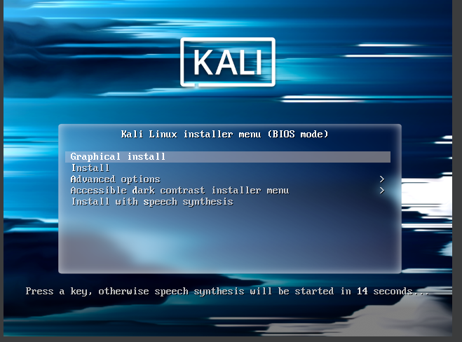{#fig:006 width=70%}

## Выбираю язык, на котором будет установка 

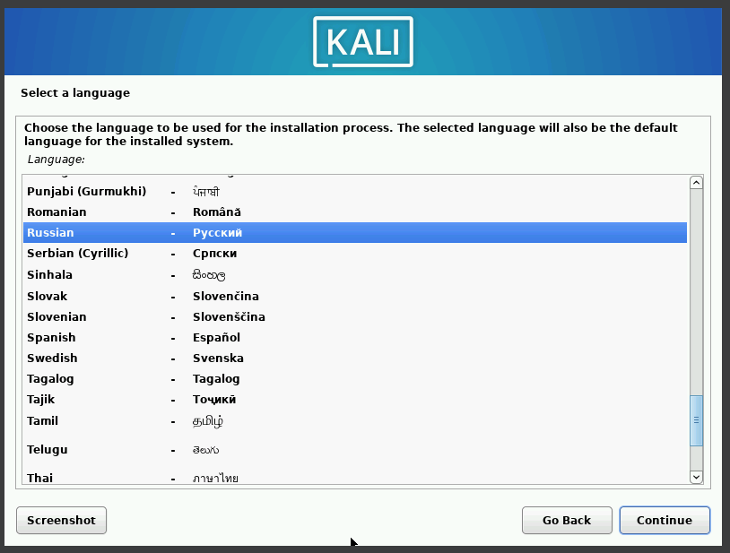{#fig:007 width=70%}

##В местоположении выбираю Российскую Федерацию 

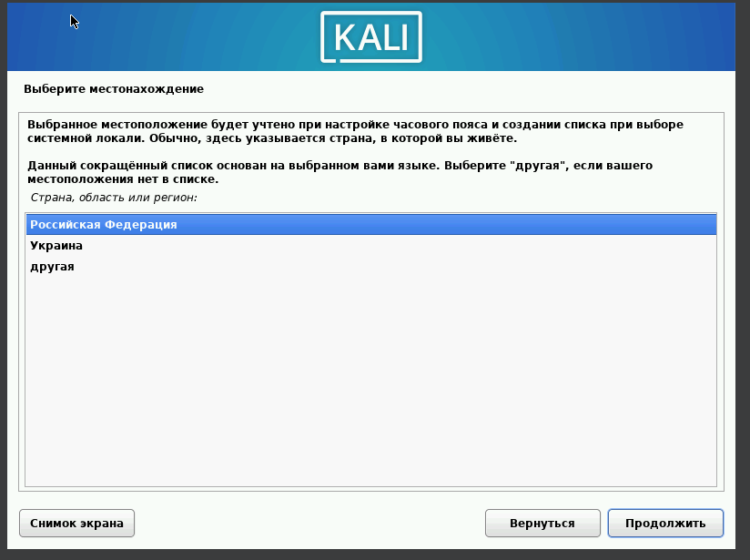{#fig:008 width=70%}

Выбираю раскладку клавиатуры

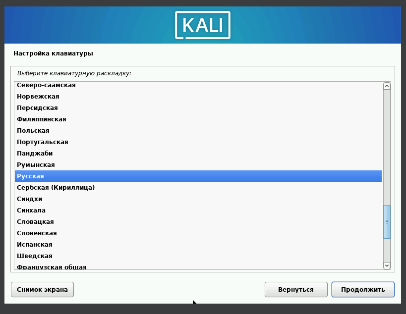{#fig:009 width=70%}

## Выбираю комбинацию горячих клавиш для переключения раскладки клавиатуры

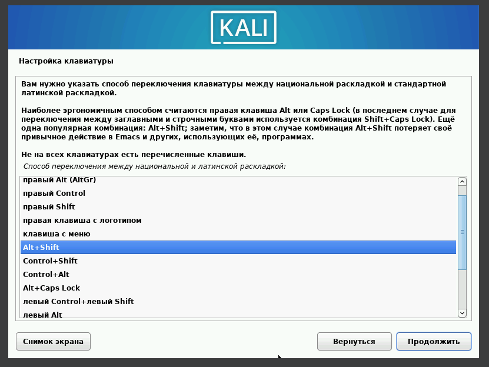{#fig:010 width=70%}

Ввожу имя компьютера имя домена и имя пользователя, у которой будут права суперпользователя

Это же имя по умолчанию предлагается как имя моей учетной записи

Ввожу пароль для созданного пользователя

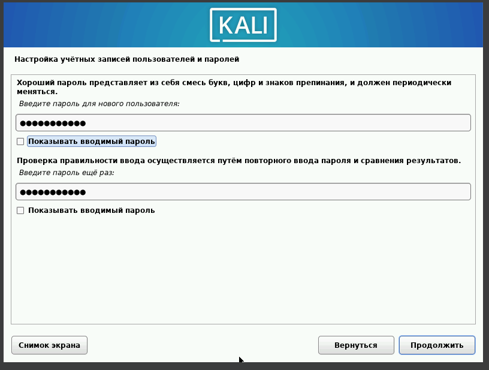{#fig:015 width=70%}

## Выбираю часовой пояс 

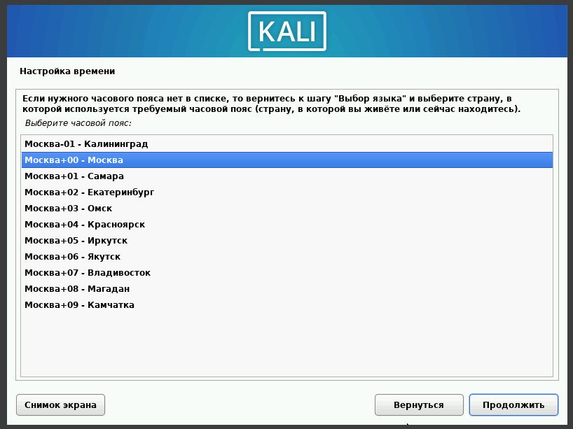{#fig:016 width=70%}

Теперь установщик проверяет диски и предлагает различные варианты,
в зависимости от настроек. Созданный виртуальный диск чистый, поэтому
я выбираю весь диск

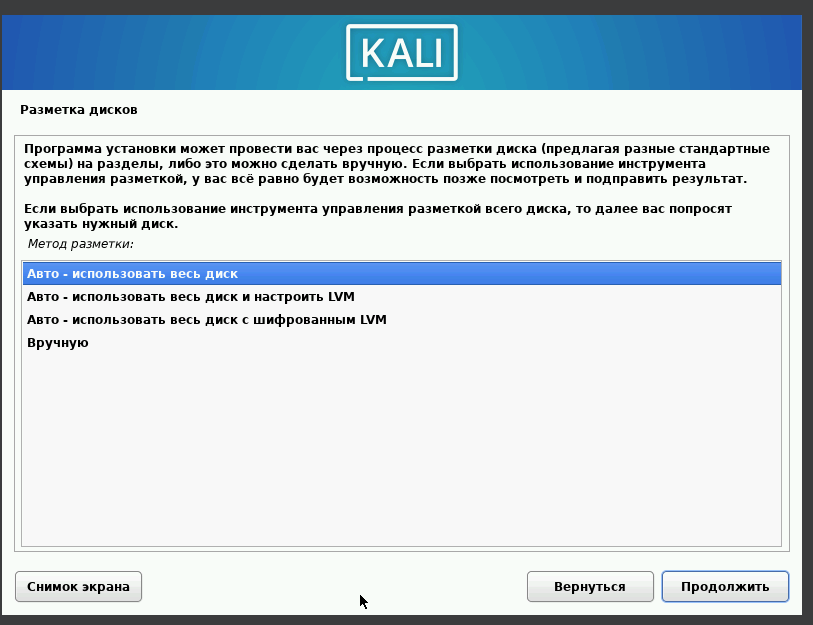{#fig:017 width=70%}

## Убеждаюсь, что выбран нужный виртуальный диск, продолжаю
настройку разметки дисков 

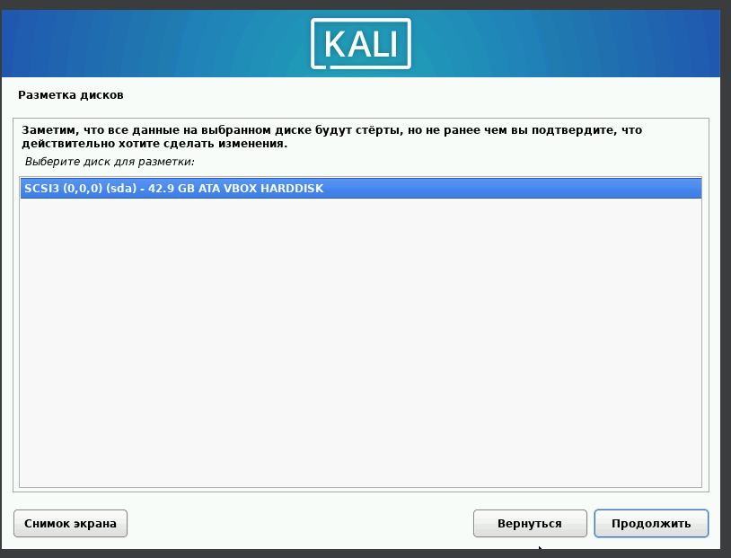{#fig:018 width=70%}

Далее установщик предлагает выбрать схему разметки, ее я оставляю по
умолчанию «все файлы в одном разделе» 

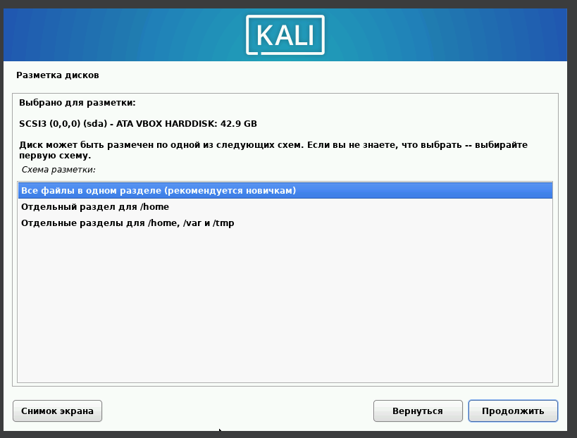{#fig:019 width=70%}

## После этого этапа надо подтвердить
окончание разметки дисков, чтобы изменения были записаны

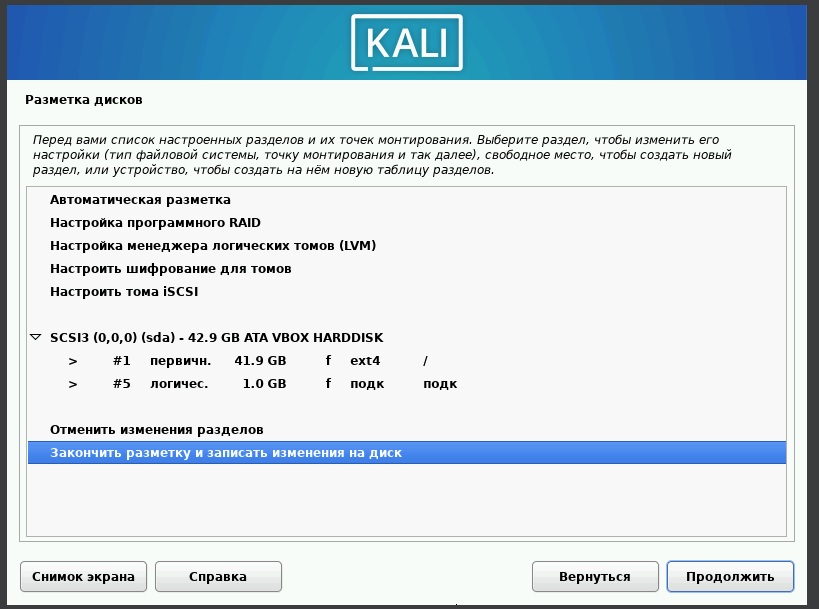{#fig:020 width=70%}

Затем установщик дает еще раз просмотреть конфигурацию диска,
прежде чем внести необратимые изменения.

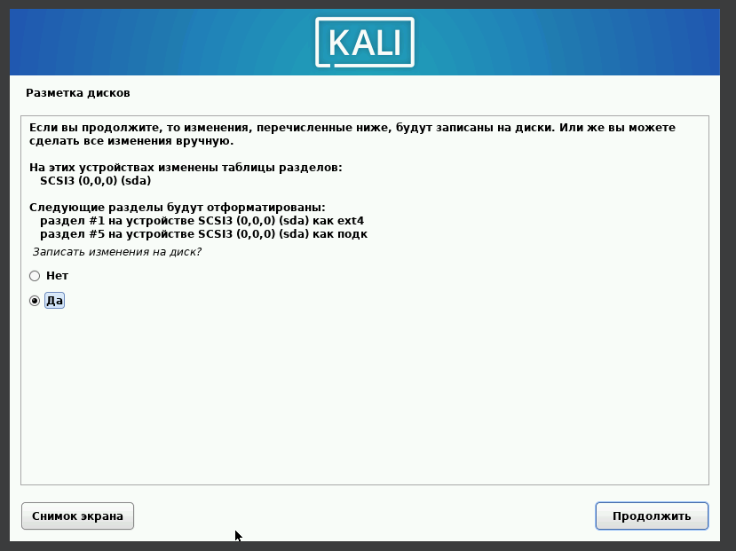{#fig:021 width=70%}

## Выбор по умолчанию установит стандартную систему Kali Linux

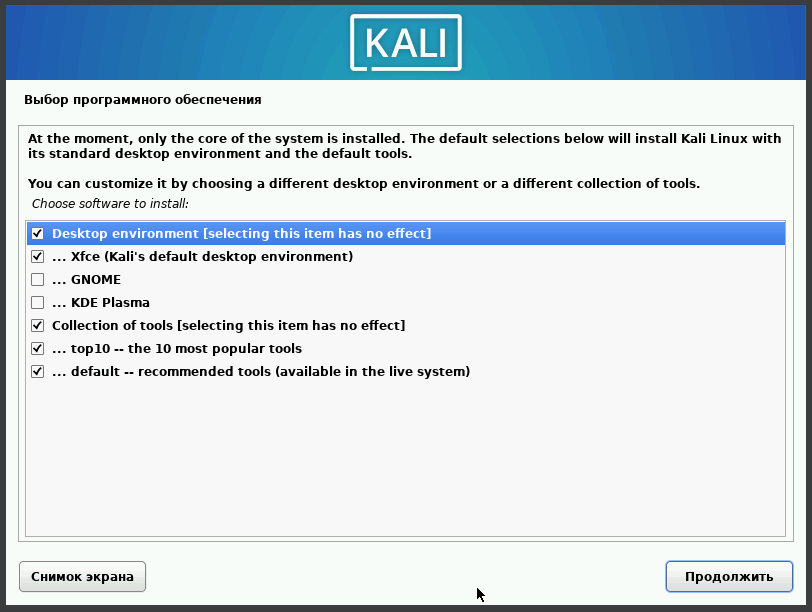{#fig:022 width=70%}

Подтверждаю установку системного загрузчика GRUB

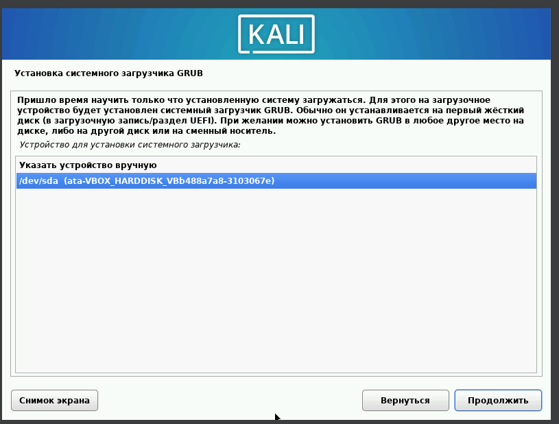{#fig:023 width=70%}

## Завершаю установку 

Проверяю, что в носителях теперь пусто

Вхожу в систему от имени своего пользователя

Вход в систему выполнен успешно, как и ее загрузка 

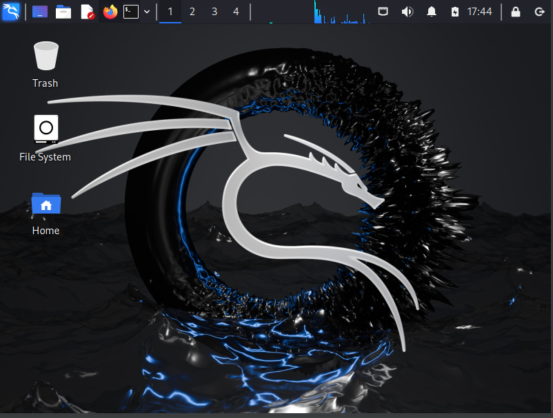{#fig:027 width=70%}

# Выводы

Приобрела практические навыки по установке операционной системы Linux на виртуальную машину. Установила дистрибутив Kali LInux на VirtualBox.

