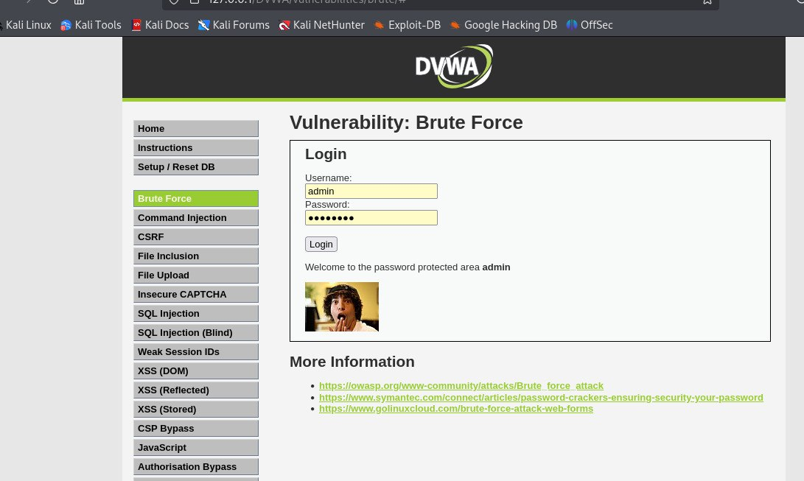

---
## Front matter
lang: ru-RU
title: Использование Hydra
subtitle: 3 этап Индивидуального проекта
author:
  - Прокопьева М.Е.
institute:
  - Российский университет дружбы народов, Москва, Россия

## i18n babel
babel-lang: russian
babel-otherlangs: english

## Fonts
mainfont: IBM Plex Serif
romanfont: IBM Plex Serif
sansfont: IBM Plex Sans
monofont: IBM Plex Mono
mathfont: STIX Two Math
mainfontoptions: Ligatures=Common,Ligatures=TeX,Scale=0.94
romanfontoptions: Ligatures=Common,Ligatures=TeX,Scale=0.94
sansfontoptions: Ligatures=Common,Ligatures=TeX,Scale=MatchLowercase,Scale=0.94
monofontoptions: Scale=MatchLowercase,Scale=0.94,FakeStretch=0.9
mathfontoptions:

## Formatting pdf
toc: false
toc-title: Содержание
slide_level: 2
aspectratio: 169
section-titles: true
theme: metropolis
header-includes:
 - \metroset{progressbar=frametitle,sectionpage=progressbar,numbering=fraction}
---

# Информация

## Докладчик

  * Прокопьева Марина Евгеньевна 
  * студент
  * Российский университет дружбы народов

# Вводная часть

# Цель работы

Hydra используется для подбора или взлома имени пользователя и пароля.
Поддерживает подбор для большого набора приложений.

# Теоретическое введение

Пример работы:

    Исходные данные:
IP сервера 178.72.90.181;
Сервис http на стандартном 80 порту;
Для авторизации используется html форма, которая отправляет по адресу http://178.72.90.181/cgi-bin/luci методом POST запрос вида username=root&password=test_password;
В случае не удачной аутентификации пользователь наблюдает сообщение Invalid username and/or password! Please try again.

## запрос к Hydra будет выглядеть примерно так:

    hydra -l root -P ~/pass_lists/dedik_passes.txt -o ./hydra_result.log -f -V -s 80 178.72.90.181 http-post-form "/cgi-bin/luci:username=^USER^&password=^PASS^:Invalid username"

Используется http-post-form потому, что авторизация происходит по http методом post.
После указания этого модуля идёт строка /cgi-bin/luci:username=^USER^&password=^PASS^:Invalid username, у которой через двоеточие (:) указывается:
путь до скрипта, который обрабатывает процесс аутентификации (/cgi-bin/luci);
 строка, которая передаётся методом POST, в которой логин и пароль заменены на ^USER^ и ^PASS^ соответственно (username=^USER^&password=^PASS^);
строка, которая присутствует на странице при неудачной аутентификации; при её отсутствии Hydra поймёт, что мы успешно вошли (Invalid username).

# Выполнение лабораторной работы

 Чтобы пробрутфорсить пароль, нужно сначала найти большой список частоиспользуемых паролей. Его можно найти в открытых источниках, я взяла стандартный список паролей `rockyou.txt` для kali linux.
 Захожу на сайт DVWA, полученный в ходе предыдущего этапа проекта. Для запроса hydra мне понадобятся 
параметры cookie с этого сайта

##1 
 
Чтобы получить информацию о параметрах cookie я установила соответствующее расширение для браузера [@cookies], теперь могу не только увидеть параметры cookie, но и скопировать их 
 

{#fig:001 width=70%}

## 2

Ввожу в Hydra запрос нужную информацию. Пароль будем подбирать для пользователя admin, используем GET-запрос с двумя параметрами cookie: безопасность и PHPSESSID, найденными в прошлом пункте
Спустя некоторое время в результат запроса появится результат с подходящим паролем 

##3 

Вводим полученные данные на сайт для проверки 

{#fig:002 width=70%}

## 4

Получаем положительный результат проверки пароля. Все сделано верно

{#fig:003 width=70%}

# Выводы

Подобрала логин и пароль пользователя 

