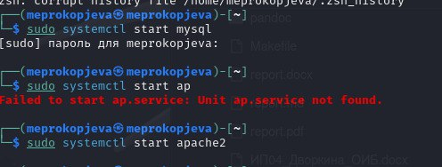

---
## Front matter
lang: ru-RU
title: Индивидуальный проект 
subtitle: 4 Этап
author:
  - Прокопьева М. Е.
institute:
  - Российский университет дружбы народов, Москва, Россия

## i18n babel
babel-lang: russian
babel-otherlangs: english

## Fonts
mainfont: IBM Plex Serif
romanfont: IBM Plex Serif
sansfont: IBM Plex Sans
monofont: IBM Plex Mono
mathfont: STIX Two Math
mainfontoptions: Ligatures=Common,Ligatures=TeX,Scale=0.94
romanfontoptions: Ligatures=Common,Ligatures=TeX,Scale=0.94
sansfontoptions: Ligatures=Common,Ligatures=TeX,Scale=MatchLowercase,Scale=0.94
monofontoptions: Scale=MatchLowercase,Scale=0.94,FakeStretch=0.9
mathfontoptions:

## Formatting pdf
toc: false
toc-title: Содержание
slide_level: 2
aspectratio: 169
section-titles: true
theme: metropolis
header-includes:
 - \metroset{progressbar=frametitle,sectionpage=progressbar,numbering=fraction}
---

# Информация

## Докладчик

  * Прокопьева Марина Евгеньвена
  * студент
  * Российский университет дружбы народов

# Вводная часть

# Цель работы

Научиться тестированию веб-приложений с помощью сканера nikto

# Задание

Использование nikto.

# Теоретическое введение

nikto — базовый сканер безопасности веб-сервера. Он сканирует и обнаруживает уязвимости в веб-приложениях, обычно вызванные неправильной конфигурацией на самом сервере, файлами, установленными по умолчанию, и небезопасными файлами, а также устаревшими серверными приложениями. Поскольку nikto построен исключительно на LibWhisker2, он сразу после установки поддерживает кросс-платформенное развертывание, SSL (криптографический протокол, который подразумевает более безопасную связь), методы аутентификации хоста (NTLM/Basic), прокси и несколько методов уклонения от идентификаторов. Он также поддерживает перечисление поддоменов, проверку безопасности приложений (XSS, SQL-инъекции и т. д.) и способен с помощью атаки паролей на основе словаря угадывать учетные данные авторизации.

##

Для запуска сканера nikto введите в командную строку терминала команду: # nikto

По умолчанию, как ранее было показано в других приложениях, при обычном запуске команды отображаются различные доступные параметры. Для сканирования цели введите nikto -h <цель> -p <порт>, где <цель> — домен или IP-адрес целевого сайта, а <порт> — порт, на котором запущен сервис

Сканер nikto позволяет идентифицировать уязвимости веб-приложений, такие как раскрытие информации, инъекция (XSS/Script/HTML), удаленный поиск файлов (на уровне сервера), выполнение команд и идентификация программного обеспечения. В дополнение к показанному ранее основному сканированию nikto позволяет испытателю на проникновение настроить сканирование конкретной цели. Рассмотрим параметры, которые следует использовать при сканировании.

##

    Указав переключатель командной строки -T с отдельными номерами тестов, можно настроить тестирование конкретных типов.
    Используя при тестировании параметр -t, вы можете установить значение тайм-аута для каждого ответа.
    Параметр -D V управляет выводом на экран.
    Параметры -o и -F отвечают за выбор формата отчета сканирования.

Существуют и другие параметры, такие как -mutate (угадывать поддомены, файлы, каталоги и имена пользователей), -evasion (обходить фильтр идентификаторов) и -Single (для одиночного тестового режима), которые можно использовать для углубленной оценки цели [@parasram].

# Выполнение лабораторной работы

Чтобы работать с nikto, необходимо подготовить веб-приложение, которое будем сканировать. Это будет DVWA. Для этого запустила apache2 

{#fig:001 width=70%}

##

Ввожу в адресной строке браузера адрес DVWA, перехожу в режим выбора уровня безопасности, ставлю минимальный (необязательно, nikto при обычном сканировании для режима impossible и low выдаст одинаковые потенциальные уязвимости, что логично, ведь они остаются, но изменяется сложность, с которой их можно использовать) 

##

{#fig:002 width=70%}

Запускаю nikto
Проверить веб-приложение можно, введя его полный URL и не вводя порт, попробовала просканировать

{#fig:003 width=70%}

# Выводы

Научилась использовать сканер nikto для тестирования веб-приложений
